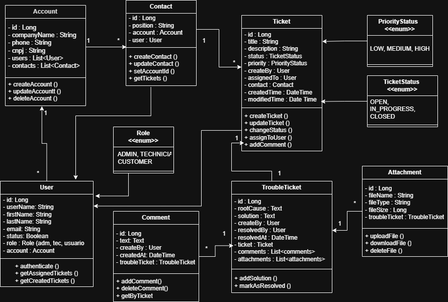

# 🛒 CRM com Helpdesk

Este é um sistema CRM com Helpdek, desenvolvido em **Java** com **Spring Boot**, utilizando **Spring Data JPA**, banco de dados **MySQL** via **Docker**, documentação com **Swagger**, arquitetura **MVC**, e uso de **Lombok** para redução de código repetitivo.

## 📌 Funcionalidades

- Registro e acompanhamento de tickets de suporte
- Atribuição de tickets a usuários responsáveis
- Gerenciamento de contas e contatos associados
- Comentários em tickets (histórico colaborativo)
- Upload e download de anexos relacionados
- Classificação por prioridade e status
- Resolução de tickets com causa raiz e solução
- Autenticação de usuários

## 🛠️ Tecnologias Utilizadas

| Tecnologia        | Finalidade                                  |
|-------------------|---------------------------------------------|
| Java 17+          | Linguagem principal                         |
| Spring Boot       | Framework principal para desenvolvimento    |
| Spring Data JPA   | ORM para acesso ao banco de dados           |
| MySQL             | Banco de dados relacional                   |
| Docker            | Containerização do banco de dados           |
| Lombok            | Redução de boilerplate no código Java       |
| Swagger (OpenAPI) | Documentação interativa dos endpoints       |

## 🧱 Arquitetura

O projeto segue a arquitetura MVC com separação por pacotes:

- model — Entidades do sistema (Ticket, User, Account, Contact, etc)
- repository — Interfaces de persistência de dados (Spring Data)
- service — Camada de regras de negócio e lógica do sistema
- controller — Camada de exposição da API REST
- config — Configurações gerais da aplicação (Swagger, segurança, etc)

## 🗃️ Modelagem (UML)
#### Diagrama do Projeto



## 🐳 Docker

### Subindo o banco de dados

```bash
docker run --name mysql-helpdesk -e MYSQL_ROOT_PASSWORD=root -e MYSQL_DATABASE=helpdesk -p 3306:3306 -d mysql:8.0
```

### Acesso via terminal:

```bash
docker exec -it mysql-helpdesk bash
mysql -u root -p
```

## 🚀 Executando o Projeto:

### ⚙️ Requisitos

-   Java 17 ou superior
-   Maven
-   Docker
 
### 📋 Etapas   
1. Clone este repositorio:

 ```bash
git clone https://github.com/seuusuario/helpdesk-system.git
```

2.   Suba o banco de dados MySQL via Docker
    
3.   Configure o `application.properties` ou `application.yml`
    
4.   Execute a aplicação com:


 ```bash
./mvnw spring-boot:run
```

## 🔍 Swagger
Após rodar o projeto, acesse a documentação interativa da API:
 
 ```bash
http://localhost:8080/swagger-ui/index.html
```

## 🗨️ Contato

Para Dúvidas ou sugestões, entre em contato: 

ruan.tor4@hotmail.com
